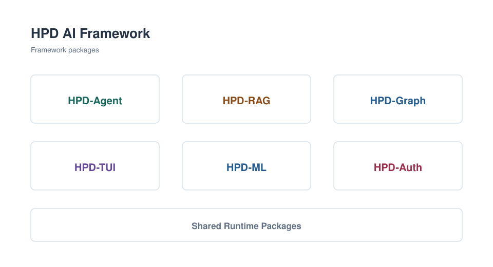
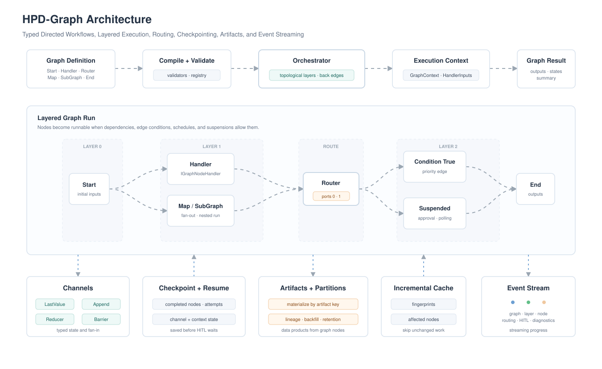

# HPD AI Framework

A C# framework for building production AI applications — agents, graph workflows, terminal UIs, RAG pipelines, ML pipelines, authentication, and everything in between.

Product documentation and websites live in their own repositories. Use the links under each architecture diagram for the canonical source and published docs when available.

<picture>
  <source media="(prefers-color-scheme: dark)" srcset="HPD-AI-Framework/assets/svg/overview-dark.svg">
  <source media="(prefers-color-scheme: light)" srcset="HPD-AI-Framework/assets/svg/overview.svg">
  
</picture>

## HPD-Agent

Production-ready agent framework — tools, multi-turn conversations, middleware, sub-agents, multi-agent workflows, audio, and more. Paired with TypeScript/Svelte UI libraries for streaming chat interfaces.

<picture>
  <source media="(prefers-color-scheme: dark)" srcset="HPD-AI-Framework/assets/svg/agent-architecture-dark.svg">
  <source media="(prefers-color-scheme: light)" srcset="HPD-AI-Framework/assets/svg/agent-architecture.svg">
  
</picture>

[GitHub](https://github.com/HPD-AI/HPD-Agent) · [Documentation](https://hpd-ai.github.io/HPD-Agent-Framework/)

---

## HPD-RAG

Fully modular RAG framework — every node in every pipeline is swappable or removable. Build your own ingestion, retrieval, and evaluation pipelines by snapping blocks together.

<picture>
  <source media="(prefers-color-scheme: dark)" srcset="HPD-AI-Framework/assets/svg/rag-architecture-dark.svg">
  <source media="(prefers-color-scheme: light)" srcset="HPD-AI-Framework/assets/svg/rag-architecture.svg">
  
</picture>

[GitHub](https://github.com/HPD-AI/HPD-RAG-Framework)

---

## HPD-Graph

Universal graph workflow orchestration for .NET — typed nodes, conditional routing, parallel execution, checkpoint/resume, HITL suspension, streaming events, artifacts, partitions, and incremental execution.

<picture>
  <source media="(prefers-color-scheme: dark)" srcset="HPD-AI-Framework/assets/svg/graph-architecture-dark.svg">
  <source media="(prefers-color-scheme: light)" srcset="HPD-AI-Framework/assets/svg/graph-architecture.svg">
  
</picture>

[GitHub](https://github.com/HPD-AI/HPD-Graph-Framework)

---

## HPD-TUI

Native AOT-friendly terminal UI framework for .NET — retained components, pooled terminal grids, model-first views, prompt flows, semantic content blocks, streaming markdown, extension hooks, and differential ANSI rendering for full-screen or normal-terminal apps.

<picture>
  <source media="(prefers-color-scheme: dark)" srcset="HPD-AI-Framework/assets/svg/tui-architecture-dark.svg">
  <source media="(prefers-color-scheme: light)" srcset="HPD-AI-Framework/assets/svg/tui-architecture.svg">
  
</picture>

[GitHub](https://github.com/HPD-AI/HPD-TUI-Framework)

---

## HPD-ML

Fully modular machine learning framework — data ingestion, feature engineering, model training, and evaluation all composable and extensible. Universal data abstraction with pluggable learners and transforms.

<picture>
  <source media="(prefers-color-scheme: dark)" srcset="HPD-AI-Framework/assets/svg/ml-architecture-dark.svg">
  <source media="(prefers-color-scheme: light)" srcset="HPD-AI-Framework/assets/svg/ml-architecture.svg">
  
</picture>

[GitHub](https://github.com/HPD-AI/HPD-ML-Framework) · [Documentation](https://hpd-ai.github.io/HPD-ML-Framework/)

---

## HPD-Auth

Hosted-auth-service experience as an embedded .NET library. Wraps ASP.NET Core Identity and exposes a ready-made REST API — JWT + Cookie dual-auth, session management, 2FA, passkeys, OAuth, admin API, and event-driven audit logging. No separate service to run. No per-user pricing. No data leaving your infrastructure.

<picture>
  <source media="(prefers-color-scheme: dark)" srcset="HPD-AI-Framework/assets/svg/auth-architecture-dark.svg">
  <source media="(prefers-color-scheme: light)" srcset="HPD-AI-Framework/assets/svg/auth-architecture.svg">
  
</picture>

[GitHub](https://github.com/HPD-AI/HPD-Auth-Framework) · [Documentation](https://hpd-ai.github.io/HPD-Auth-Framework/)
