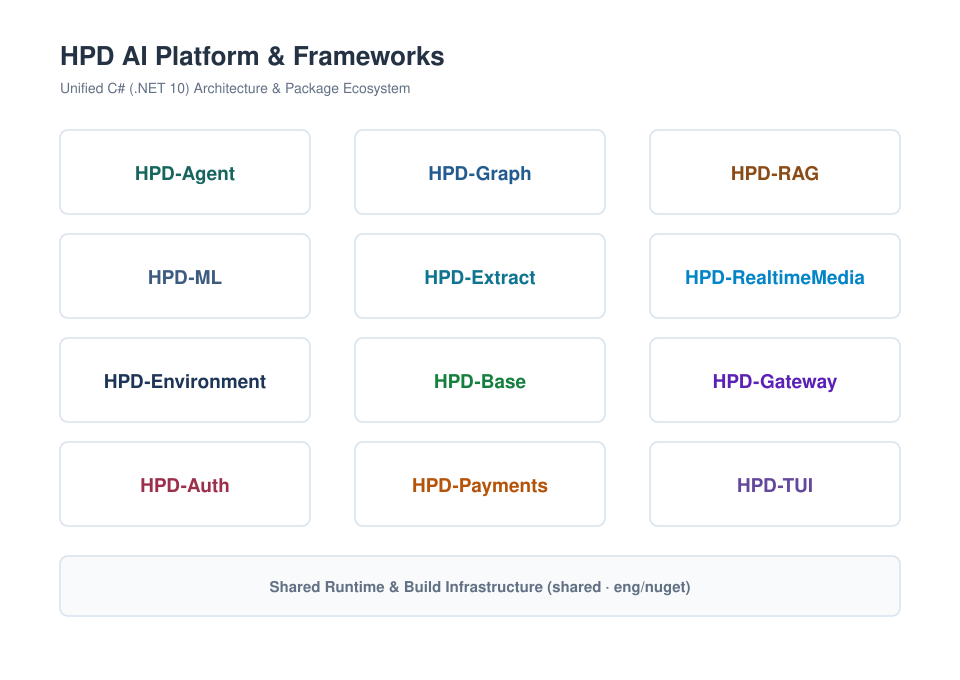

# HPD AI Framework

A set of C# (.NET 10) frameworks for building production AI applications, autonomous agents, sandboxed compute environments, high-precision document extraction, data persistence, and sovereign financial infrastructure. Use the package family that matches the thing you need to build: AI agents, RAG, graph workflows, terminal UIs, ML pipelines, authentication, document extraction, realtime media streaming, sandboxed execution, application data, API gateways, or financial ledgers.

Product documentation, websites, and opinionated product layers live in their own repositories. Use the links under each package section for the canonical source and published docs when available.

<picture>
  <source media="(prefers-color-scheme: dark)" srcset="assets/svg/overview-dark.svg">
  <source media="(prefers-color-scheme: light)" srcset="assets/svg/overview.svg">
  
</picture>

---

## HPD-Agent

Use HPD-Agent to build production agents that can talk to models, call tools, stream events, manage sessions, hand work to sub-agents, handle deduplicated user inputs, and expose chat surfaces.

[GitHub](https://github.com/HPD-AI/HPD-Agent) · [Documentation](https://hpd-ai.github.io/HPD-Agent-Framework/)

---

## HPD-RAG

Use HPD-RAG to build retrieval systems where ingestion, storage, search, reranking, formatting, and evaluation can be replaced or removed independently.

[GitHub](https://github.com/HPD-AI/HPD-RAG-Framework)

---

## HPD-Graph

Use HPD-Graph to run typed workflow graphs that need routing, parallel layers, checkpoint/resume, human or external waits, artifacts, partitions, and incremental execution.

[GitHub](https://github.com/HPD-AI/HPD-Graph-Framework)

---

## HPD-ML

Use HPD-ML to build machine-learning pipelines with a common data abstraction, composable transforms, pluggable learners, evaluation, and model serialization.

[GitHub](https://github.com/HPD-AI/HPD-ML-Framework) · [Documentation](https://hpd-ai.github.io/HPD-ML-Framework/)

---

## HPD-Extract

Use HPD-Extract for high-precision, multi-modal document,image,wesbite text extraction.

[GitHub](https://github.com/HPD-AI/HPD-Extract-Framework)

---

## HPD-RealtimeMedia

Use HPD-RealtimeMedia for low-level, allocation-conscious media infrastructure: WebRTC signaling, ICE candidate gathering, STUN/TURN bindings, RTP/RTCP packetization and repair, SRTP encryption, and Opus/G.711 audio pipelines[cite: 8].

[GitHub](https://github.com/HPD-AI/HPD-RealtimeMedia-Framework)

---

## HPD-Environment

Use HPD-Environment to orchestrate sandboxed compute runtimes: virtual machines, native containers, Wasm/native function sandboxes, software-defined networking, storage volume reservations, and authority-first security teardown[cite: 2].

[GitHub](https://github.com/HPD-AI/HPD-Environment-Framework)

---

## HPD-Base

Use HPD-Base as your application data runtime: collections, fail-closed policy enforcement, atomic multi-collection batches, transactional receipts, live query replacement recomputation, and co-located SQLiteVec vector search[cite: 1].

[GitHub](https://github.com/HPD-AI/HPD-Base-Framework) · [Documentation](https://hpd-ai.github.io/HPD-Base-Framework/)

---

## HPD-Gateway

Use HPD-Gateway to embed ASP.NET Core-native, YARP-backed API gateway capabilities into your app: candidate configuration validation, Microsoft Service Discovery integration, Redis-backed distributed token-bucket admission, and optional standalone Native AOT binaries[cite: 4].

[GitHub](https://github.com/HPD-AI/HPD-Gateway-Framework)

---

## HPD-Auth

Use HPD-Auth when you want hosted-auth-service ergonomics inside your own ASP.NET app: identity, sessions, JWT/cookie auth, 2FA, passkeys, OAuth, admin APIs, and audit events without a separate service.

[GitHub](https://github.com/HPD-AI/HPD-Auth-Framework) · [Documentation](https://hpd-ai.github.io/HPD-Auth-Framework/)

---

## HPD-Payments

Use HPD-Payments to run formal double-entry financial ledgers and billing lifecycles across 17 closed authority domains, featuring compare-bind generation guards, out-of-process authenticated extension hosts, and deterministic virtual-time simulation.

[GitHub](https://github.com/HPD-AI/HPD-Payments-Framework)

---

## HPD-TUI

Use HPD-TUI to build native AOT-friendly terminal interfaces that stay allocation-conscious while rendering retained views, prompts, trees, tables, markdown, and streaming output.

[GitHub](https://github.com/HPD-AI/HPD-TUI-Framework)

---

## HPD-AI Use Discretion

HPD-AI Framework is pre-1.0. Until `1.0.0`, API and persistence contracts may continue to evolve as the framework stabilizes.